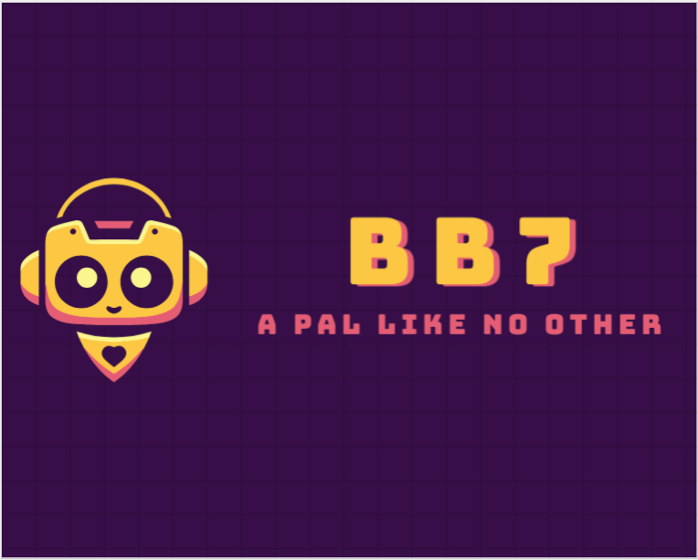

# bb7




A TDD coding bot using ollama.

Introducing "bb7", an advanced chat bot designed for versatile interactions. Equipped with TTS (Text-to-Speech) capabilities, bb7 enables seamless voice conversations with users. It also supports local Retrieval-Augmented Generation (RAG), allowing for efficient document-based queries and responses, even without cloud dependency.

### Prerequisites

First, install ollama

```
curl -fsSL https://ollama.com/install.sh | sh
```

Windows: https://ollama.com/download/windows


And install a model.

```
ollama run llama3.2
```

### Installation
```
pipx install bb7
```

If the installation is not working well,
please install 0.3.3 first, then upgrade to latest.

```
pipx install bb7=0.3.3
pipx upgrade bb7
```


### Demo

Chat:

```
bb7
```

```
Usage: bb7 [OPTIONS]

Options:
  -t, --test  Run tests and write tests.
  -h, --help  Show this message and exit.
```


```
bb7 is a TDD coding bot. It can recognize the Python project structure,
find the tests folder, and run tests. It can also chat with a chatbot.
The current directory is not in a Python project.
```


```
Welcome to the bb7 Chat Terminal!
>> /help
Available commands:
/exit, /quit, /q - Exit the chat
/clear - Clear the screen
/voice  - Voice output last message
/select - Select voice language
/activate - Activate a document
/deactivate - Deactivate a document
/load - Load a document
/model [llama3.2] - Select a model
/help - Show this help message
>> 
```


