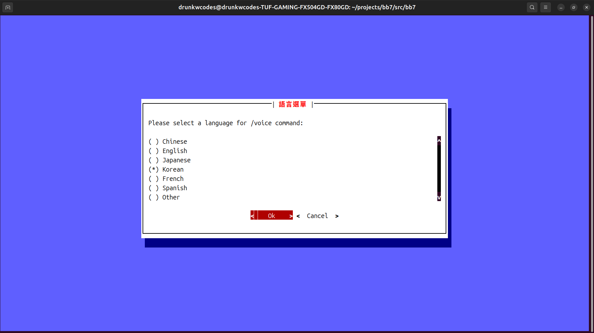

# bb7
A TDD coding bot using ollama

### Prerequisites

First, install ollama

```
curl -fsSL https://ollama.com/install.sh | sh
```

And install a model.

```
ollama run llama3.2
```

### Installation
```
pipx install bb7
```

Chat:

```
bb7
```

```
Usage: bb7 [OPTIONS]

Options:
  -t, --test  Run tests and write tests.
  -h, --help  Show this message and exit.
```


```
bb7 is a TDD coding bot. It can recognize the Python project structure,
find the tests folder, and run tests. It can also chat with a chatbot.
The current directory is not in a Python project.
```


```
Welcome to the bb7 Chat Terminal!
>> /help
Available commands:
/exit, /quit, /q - Exit the chat
/clear - Clear the screen
/voice [ja] - Voice output last message
/help - Show this help message
>> 
```


